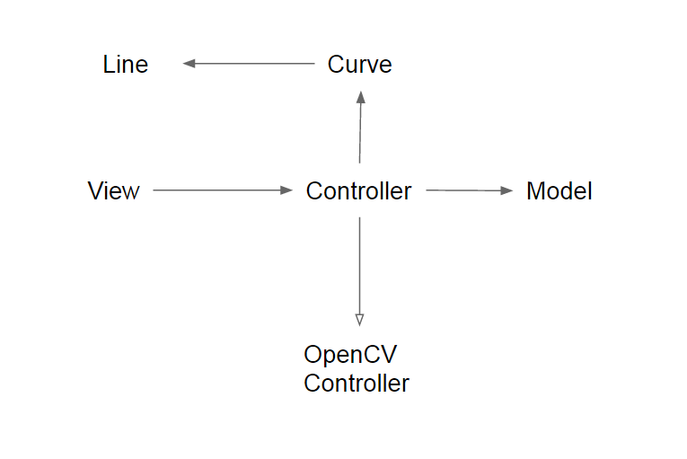

---
title: Implementation
layout: template
filename: story2
--- 
### Methods

As we implemented this project, we started using various numerical methods. Since our code takes in a raw user-drawn line, if we worked with that line directly it would be jagged, leading to a wildly changing derivative. To solve this problem, we smoothed the line using cubic interpolation. First, we select a small set of points from the input (pull points). Between two points, we will draw a cubic function such that its derivative at the pull points matches the derivative of the cubic in the leading and following pairs. The domain of the cubic function is restricted by the two poitns. This is handled by SciPy. As a result, we get a unique smooth continuous function that we can easily differentiate and integrate. We can also use pull points to move the curve around in a predictable way. 

After interpolation, we can have an arbitrarily large density of points. Therefore, we can very simply and precisely get the derivative of the line numerically, by getting the slope between any two consequent point. 

Similarly to differentiation, we can get the curve’s integral using trapezoidal approximation. We find the area between two consecutive points by getting the area of the trapezoid defined by the two points and their projection onto the x-axis. 

Open CV drawing uses a similar code structure to http://www.pyimagesearch.com/2015/09/14/ball-tracking-with-opencv/. 
cv2.inRange() and masks are used to detect contours of a colored object. The position of the center of the contour passes from the Opencv controller to curve. Color ranges are in hsv and can be set from http://colorizer.org/. Currently it supports bright pink and bright green. The open CV mask is flipped and displayed in the pygame window. 

### Code Structure

We adopted the model-view-controller framework in this project. Below is a UML diagram of our code structure. The Line class contains methods for processing lines (deriving etc.). The Curve class keeps track of the input, integral and derivative Lines in relation to one another. 

